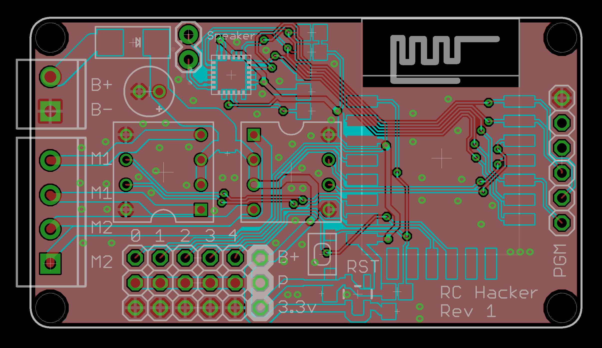

# rc-hacker

The RC Hacker combines the ESP8266 with 2 H bridges and
a MONO audio DAC/AMP and 5 GPIO. It is Programmed over
WIFI and is intended to be used to "Upcycle" old toys and
turn them into programable robots.

- ESP8266-12 wifi module
- Dual L9110 (800ma) DACs
- ALC5628 DAC+AMP
- Screw Terminals to attatch motors
- 5x 0.1" 3 pin headers for additional sensors/servos and 1 analog in.
